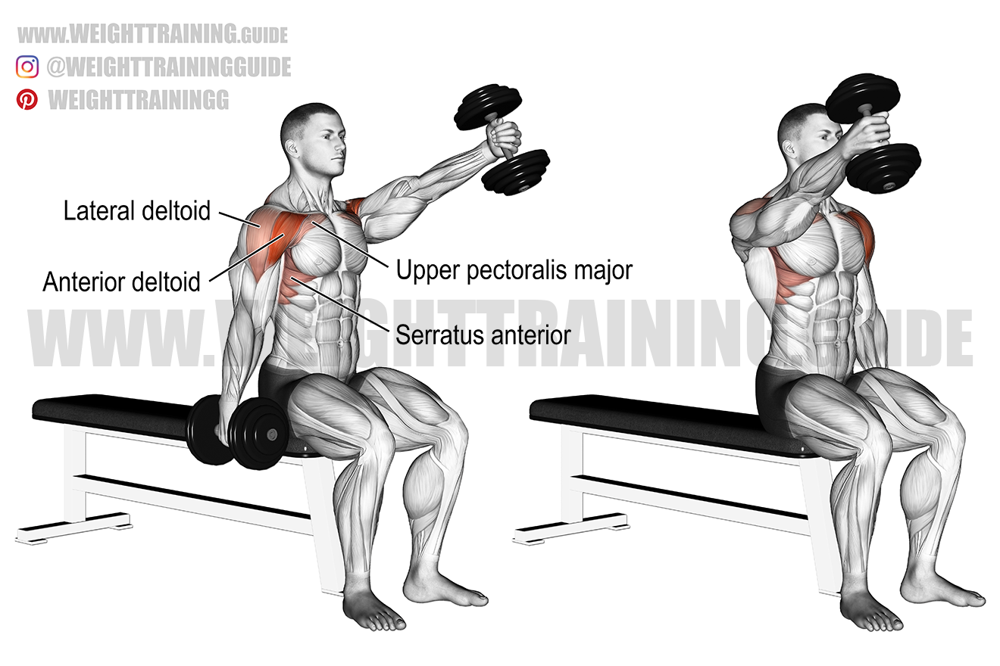
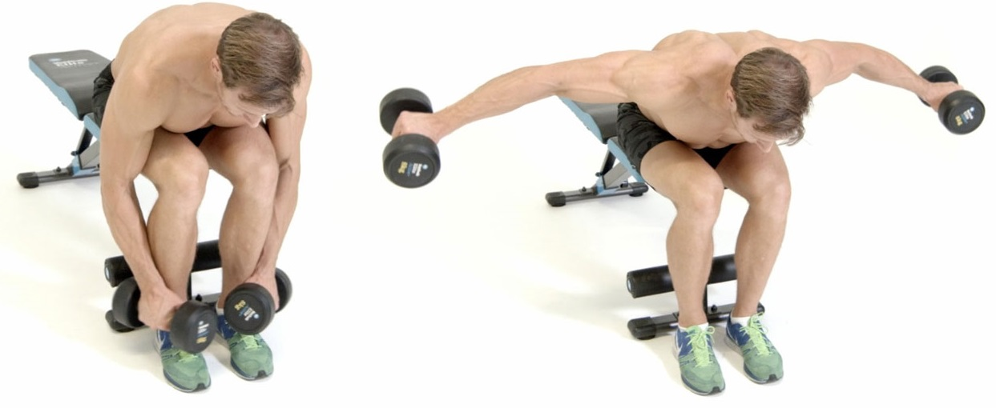

## 常识

### 收紧核心

收紧核心不是把肚子收进去，而是一般缓慢吐气或屏息的同时腹肌发力，让整个腰腹坚硬，让身体稳定，防止拉伤和代偿，尤其是保护腰背。

### 呼吸与发力

健身中的呼吸规律一般是发力（如推起，举起，起身）呼气，反之吸气。在发力呼气时，收紧核心。而在力竭附近时可以呼吸-屏息-完成动作-呼吸提高运动能力，并且屏息时收紧核心。

### 如何握哑铃

拇指环握在食指上。注意**不要手腕外翻**，防止手腕受伤。

## 肩部

> 建议：三个部位交替循环练习，一次三组，一组16-20次，两日一练，最初可以徒手找发力感。

肩部属于小肌群。肩部主要肌肉名称：三角肌，包含前束，中束，后束。

| 前束                                                         | 中束                                                         | 后束                                                         |
| ------------------------------------------------------------ | ------------------------------------------------------------ | ------------------------------------------------------------ |
|  |  |  |

### 注意点

- 不要肩膀内旋，会受伤！原理见https://www.bilibili.com/video/BV1sp4y1D7bE
- 不要耸肩，耸肩会利用斜方肌代偿，使训练效果下降。斜方肌就是脖子两侧的肌肉，发达后可能会影响美感。
- 在最高点停顿一秒左右，下放时也要缓慢，不依靠惯性。
- 大部分人的后束都不发达，许多人健身也不会练习后束，因此刚开始练习可以用更小的重量找发力感。

### 前束训练：哑铃坐姿交替前平举

- 之所以选择坐姿而不是站姿是为了减少腿部和腰部借力。
- 前举到略微高于肩膀，手臂可以外旋，但**一定不要内旋**。
- **要注意一定不要耸肩**（如果耸肩可以减小重量）。

### 中束训练：哑铃侧平举

- 平举到最高点可以稍作停顿。
- 建议身体稍微前倾，双腿微曲，但腰部保持挺直。
- 千万不要内旋，可以在高点外旋，斜45°，使得拇指高于小指。

### 后束训练：俯身（反向）飞鸟

- 相比于站姿俯身飞鸟，坐姿可以更好的保持稳定，不需要腰背发力维持上半身挺直，防止腰部发力错误受伤。
- **不要耸肩**
- **保持手肘始终朝上**，手肘朝后斜方肌会代偿。另外可以手臂略微弯曲，不需要完全伸直，减少肘关节的压力。具体可以参考站姿俯身飞鸟
    - 
- **不要刻意收缩肩胛骨**
- 总之，后束的练习需要小重量，正确发力。在正确发力练习结束后可以明显感到肩部后束的酸胀。

## 背部

> 建议：一次五组，一组8-12次，三日一练。

背部属于大肌群，主要包含斜方肌，菱形肌，背阔肌和竖脊肌三部分，这里我们把竖脊肌的练习归类到腰部上。

| 斜方肌                             | 菱形肌                                                       | 背阔肌                              |
| ---------------------------------- | ------------------------------------------------------------ | ----------------------------------- |
|  |  |  |

基本上大部分的背部肌肉可以通过划船练习。

### 单手哑铃俯身划船

- 之所以不用双手划船是因为相对于杠铃，双持哑铃时腰背更难保持水平稳定。并且用一只手支撑可以减轻腰部的压力。
- 需要注意的是，俯身时上半身和腿保持一个钝角，两腿大概与肩同宽，背部保持水平。
- 不要弓背，保持腰挺直。
- **手臂不要代偿**，划船的动作最容易利用二头肌代偿，划船结束后大臂酸胀，后背反倒没有感觉。我的经验是：
    - 在划船提起时，首先手臂不夹紧躯干，手肘和躯干平行时可以留出一拳的距离。
    - 在提起手臂前吐气，收紧核心，放松大臂，做一个类似耸肩的动作作为激活。具体参考此视频https://www.bilibili.com/video/BV13q4y1B7wj
    - 可以稍微把手臂旋转一个角度，具体需要自己尝试，寻找发力感明显的角度。参考此图
    - 

## 手臂

> 建议：三个部位交替循环练习，一次三到五组，一组8-12次，两日一练。注意手臂和胸、背不在同一天练习，或在每次练习最后练习，否则脱力会影响其他部位训练。

手臂属于小肌群。手臂一般只训练大臂，包括肱二头肌，肱三头肌和肱肌两部分，肱二头肌的长头也是我们最熟悉的肌肉。

| 肱二头肌                  | 肱三头肌                                                     |
| ------------------------- | ------------------------------------------------------------ |
|  |  |

### 肱二头肌：哑铃坐姿单臂弯举

二头肌的作用就是收缩手臂，所以所有的弯矩类动作都可以锻炼二头肌。

之所以推荐坐姿是因为这个动作可以用来冲击大重量，而加大重量时坐姿相比站姿可以刚好的保持平衡和稳定。

- 手腕可以轻微内扣
- 将手肘稍微向上位置的大臂枕在大腿上，不要将小臂或手肘枕在大腿上。
- 举起呼气，放下吸气，下放到最低点时手臂不要完全伸直，否则对手肘压力较大。

### 肱三头肌：臂屈伸

三头肌的作用是伸开手臂，所有的屈伸类动作都可以练习三头肌。三头肌也起到了收束手臂的作用，可以让手臂更紧致，没有赘肉的松弛感，但实际上很多人只注重二头肌的训练而忽视了三头肌，这会使手臂看起来后侧单薄，甚至有赘肉。

这里有两个动作推荐，按照难度递增。

#### 哑铃窄距卧推

- 窄距卧推看似是在练习胸肌，实际上主要练习三头肌。
- 手臂加紧躯干。
- 在高点时，拇指可以高于小指向上伸，这样可以使得手肘完全伸直。相比于哑铃臂屈伸类动作，卧推可以在手肘伸直时减少肘关节的压力，并且保持手臂稳定。另外完全伸直手臂可以更好的刺激三头肌的内测。

#### 臂屈伸

- 可以通过调整双脚的前后来增加或减少难度。
- 这里建议双手手指朝向两侧，而不是如图中手指向前，向前肩部会内旋，做了以后肩膀疼。
- 只用脚跟着地或许更合理。
- 可以在大腿上放重物增加负重。

### 肱肌：锤式越体弯矩

- 如名称所说，在举起时哑铃要越过身体中线，而不是图中位置。
- 手可以握拳使得拇指指向自己，减少二头肌的发力。

## 腰部

> 腰部其实在收紧核心俯身时就会有练习到。居家更多是活动腰部，可以每日一练。

竖脊肌的作用是维持腰部挺直，保护脊椎，腰部也是健身中最容易受伤的部位之一。挺身类动作都可以有效锻炼竖脊肌。

### 俯卧两头起

- 这个动作需要慢慢做，快速起身容易受伤。

## 腿部

## 胸部

## 腹部

